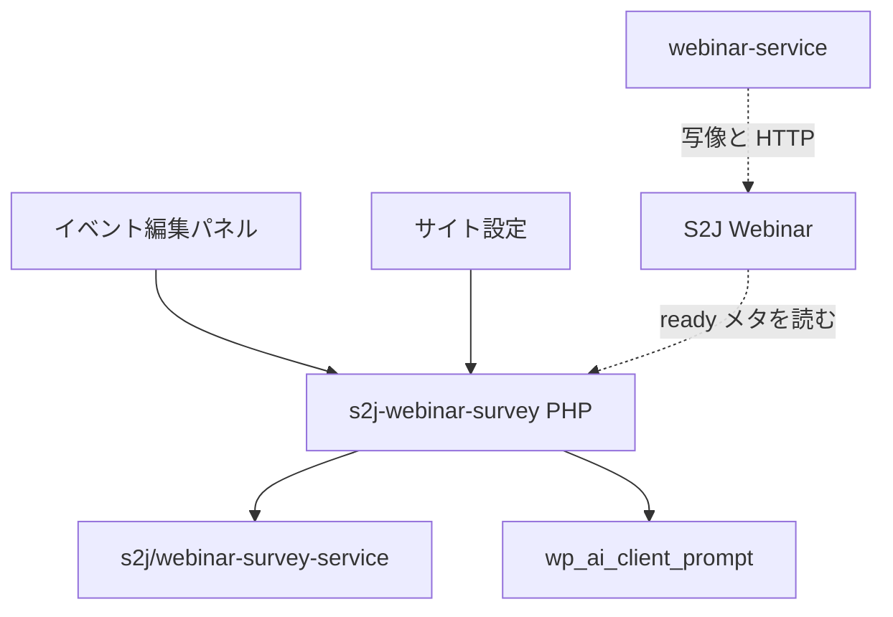

<!--
目的：「フォルダー構成、主要ファイル、技術スタック、責務」の明文化
-->

# S2J Webinar Survey - アーキテクチャー

## 設計意図 (ゴール)

設問の編集・保存・不足と助言のメッセージ表示・下書き UX を WordPress 側に閉じ、判定本体を Composer ライブラリに委ねます。GatherPress フォークは改変しません。

## 設計方針

* 本プラグインはアダプタ。FOP (Functional Object-Oriented Programming) の計算はサービス。
* フック登録、設定、メタ、コネクタ呼び出しは本プラグイン。

## レイヤー構成

| 層 | 責務 | 非責務 |
| --- | --- | --- |
| UI (React / パネル) | 入力、不足と助言のメッセージ表示、下書き候補の採用 UI | 不足判定の本体。Service の直接呼び出し |
| Plugin PHP | フック、メタ、option、サービス呼び出し (`evaluate` / 下書き bridge。REST 等)、コネクタ | Zoom HTTP |
| Survey Service | `evaluate` / `build_draft_prompt` / `parse_draft_response` | WP / Zoom |

`evaluate` (表示専用含む) も下書きも、**UI → 本プラグイン PHP (REST 等) → Service** とする。クライアントから Service を直接呼ばない。表示専用は `POST …/v1/evaluate` (初版出力はコード列のみ)、下書きは `POST …/v1/draft` (1リクエスト)。契約の正本は [persistence_spec.md](./persistence_spec.md) / [draft_ui_spec.md](./draft_ui_spec.md)。パネル文書は `_s2j_webinar_survey` を `register_post_meta` (`object` / `show_in_rest` / `edit_post` 相当の auth) で載せ、保存は `save_post` で正規化上書きする (クライアントの `status` は信頼しない)。



## フォルダー構成 (想定)

公開の計算面は、サービス側の名前空間の関数3つだけです。本プラグインは、それらを呼ぶ薄い橋です。

```plaintext
s2j-webinar-survey/
├── README.md
├── LICENSE
├── composer.json              # require s2j/webinar-survey-service
├── package.json
├── s2j-webinar-survey.php
├── uninstall.php
├── docs/                      # 確定仕様 (governance / archive 含む)
├── docs_mod/                  # 改訂案と進行中イニシアチブ証跡
├── includes/                  # PHP (Settings、Meta、Evaluate bridge、Draft bridge)
├── src/                       # TS/React (admin settings、event panel)
├── languages/
└── vendor/                    # Composer (配布物では同梱方針に従う)
```

## 技術スタック

| 項目 | 方針 |
| --- | --- |
| PHP | WordPress 要件に合わせる。サービスは PHP v8.1以上 |
| UI | React (Vite)。イベント編集パネル + サイト設定 |
| 依存ライブラリ | `s2j/webinar-survey-service` |
| 下書き | `wp_ai_client_prompt()` (コネクタ)。キーは持たない |
| ドキュメント lint | `@s2j/docs-linter` / `npm run lint:docs` |

## プラグインとの境界 (外)

| 置き場 | 中身 |
| --- | --- |
| 本プラグイン | 編集、保存、メッセージ表示 (i18n)、コネクタ、上限のサイト設定 |
| Survey Service | 計算 |
| S2J Webinar / webinar-service | Zoom 添付 |

## 関連

* 原則: [principles.md](./principles.md)
* サービス構成: [survey-service architecture](https://github.com/stein2nd/s2j-webinar-survey-service/blob/main/docs/architecture.md)
