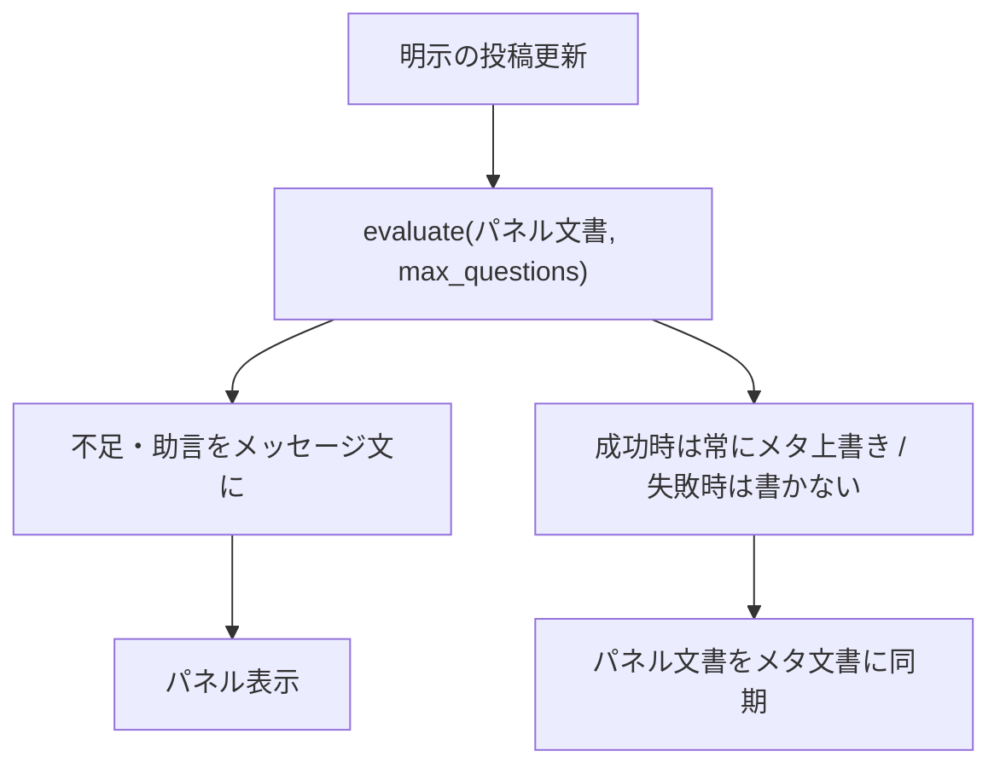
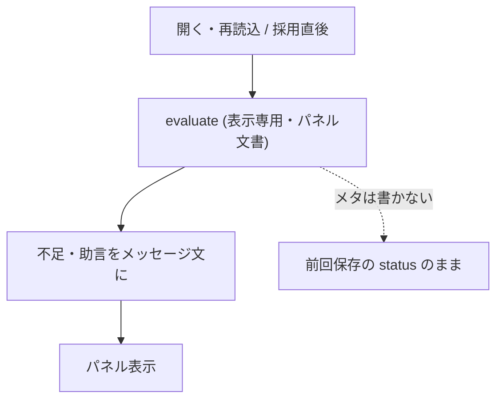
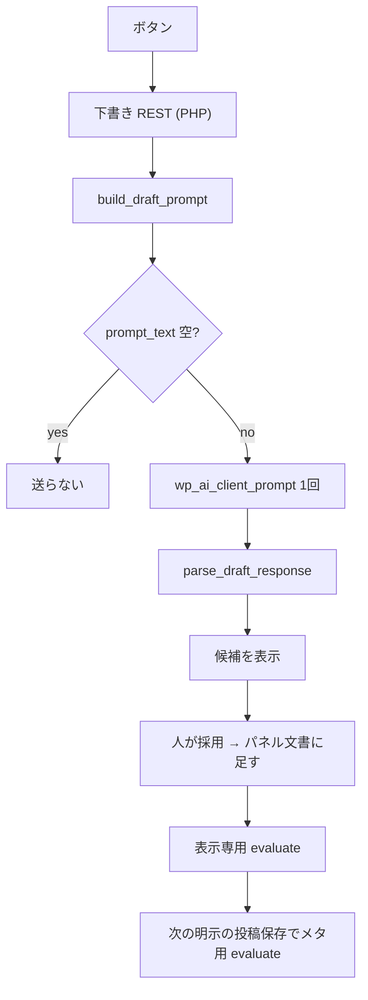

<!--
目的：「想定ユースケース、解決する課題、処理フロー」の明文化
-->

# S2J Webinar Survey - コンセプト

## 前提条件

* 運営者が、GatherPress のイベント編集画面でその回のアンケート設問を書く。
* 設問総数の上限はサイト設定1つ。イベントごとには持たない。
* 下書きはボタン押下時だけ、サイトのコネクタに1回送る。
* Zoom への添付は、S2J Webinar が `ready` のメタだけを読む。

## 解決する課題

Zoom Webinar 実施後のアンケート回答率が低い、という状態を改善します。

長い設問、後ろに置かれた選択式、必須の自由記述が重なると、参加者は答えることを躊躇することは自明です。そして、次の企画に活かせない問いが重なると、運営者も次回に活かせません。

本プラグインは、作成リクエストの組立とは別に、設問の良し悪しを画面上の助言として返します。判定本体はサービス、表示と保存は本プラグインです。

## ユースケース

| 場面 | 利用者 | 本プラグインの役割 |
| --- | --- | --- |
| イベント編集で設問を保存する | 運営者 | 投稿保存でサービスに評価し、不足・助言を適切なメッセージ文で表示してメタ文書へ保存 |
| 設問の下書きを頼む | 運営者 | 依頼文組立 → コネクタ1回 → 候補表示。採用までパネル文書／メタ文書に書かない |
| サイトの上限を変える | 管理者 (`manage_options`) | オプション保存。パネルには上限入力を出さない |
| Webinar 作成直後にアンケートを付ける | S2J Webinar | 関与しない (`ready` メタを読むのは相手側) |

## 処理フロー

### 投稿保存時 (イベント編集からの明示の更新)

パネル専用の単独保存は持たない。除外の正本は [persistence_spec.md](./persistence_spec.md) (autosave・リビジョン・Quick Edit・一括編集・WP-CLI / REST。初版) です。

メタ上書きとパネル同期は成功時のみ。失敗時はメタを書かず、パネルは編集中のまま。正本は [persistence_spec.md](./persistence_spec.md)。

### パネル表示時 (表示専用)

入力は常にいまのパネル文書である。発火は開く／再読込 (その時点の上限)／採用直後のみ。サイト設定変更だけでは開いたままの画面は自動更新しない。搬送は PHP 経由。正本は [admin_ui_spec.md](./admin_ui_spec.md) / [persistence_spec.md](./persistence_spec.md) です。

### 下書きボタン

UI は下書き REST を1回呼ぶ。下記は **サーバー内** (`build` → コネクタ → `parse`) である。クライアントから Service / コネクタを直接呼ばない。正本は [draft_ui_spec.md](./draft_ui_spec.md)。

## 責務分離

| 層 | 役割 |
| --- | --- |
| 本プラグイン | 画面、保存、表示文、コネクタ、上限のサイト設定 |
| Survey Service | 検査、助言、依頼文、分解。副作用なし |
| S2J Webinar / webinar-service | Zoom 添付の写像と HTTP |

## 関連

* 概要: [overview.md](./overview.md)
* サービス使用方法: [usage_spec.md](https://github.com/stein2nd/s2j-webinar-survey-service/blob/main/docs/interfaces/usage_spec.md)
