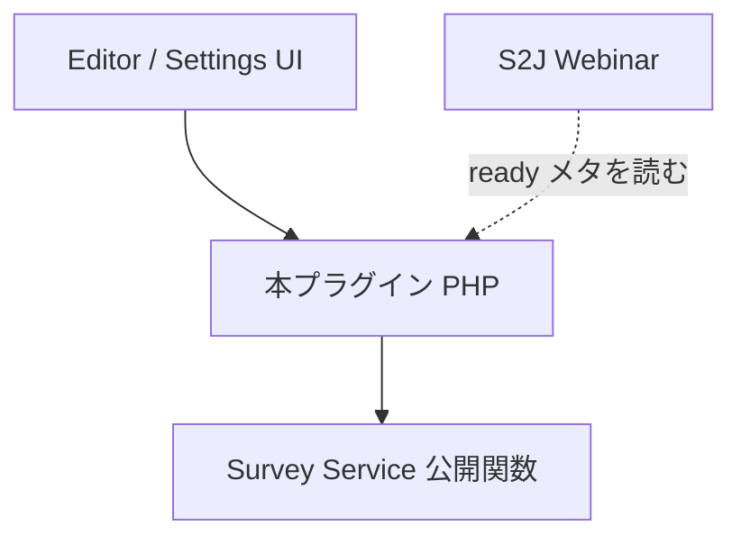

<!--
設計原則
-->

# S2J Webinar Survey - 設計原則

## 原則

### 1. Source of Truth

* 計算規則の正本は、Survey Service の `docs/core/` である。
* メタキー、option、パネル文言の正本は、本 `docs/` である。
* README は最短手順であり、契約と矛盾させない。

### 2. アダプタである

* 本プラグインは、WordPress の画面と永続化の外側である。
* ビジネス規則 (不足・助言・下書き分解) を PHP/JS に再実装しない。
* Composer で `s2j/webinar-survey-service` を Packagist 名だけで require する (`VCS` / `path` は書かない)。

### 3. 依存の向き

* サービスは WordPress を知らない。
* GatherPress フォークに、本機能のコードを置かない。

### 4. 助言は保存を拒まない

* 不足がある場合だけ `draft` である。助言 (例: `too_many`) があっても `ready` にできる。
* 助言・不足コードはメタの正本に残さない。
* **保存のトリガー**は GatherPress イベント編集画面からの明示の投稿「更新」である (初版)。パネル専用保存は持たない。除外と許可の正本は [persistence_spec.md](./persistence_spec.md) (autosave、リビジョン、Quick Edit、一括編集、WP-CLI、独自カスタム REST によるメタ保存は除外。エディター経由のコア投稿 REST + `save_post` は許可)。
* **投稿保存時:** パネル文書を `evaluate` し、成功時は戻りでメタ文書を常に上書きする (失敗時は書かない)。クライアント生メタは正本にしない。
* **表示専用 `evaluate`** (メタ文書非書き戻し): 入力は常にいまのパネル文書。発火はパネルを開いた／再読込したとき (その時点のサイト上限を含む)、下書き採用直後のみ。キー入力のたびには走らせない。開いたままの画面はサイト設定変更で自動更新しない。搬送は UI → 本プラグイン PHP (REST 等) → Service。詳細は [persistence_spec.md](./persistence_spec.md)。
* 不足・助言のメッセージは、直前に走らせた `evaluate` (投稿保存時または表示専用) の結果から出す。
* **「状態」**はメタ文書の `status` (保存済み) だけを指す。S2J Webinar が読むのもこの保存済み `status` である。不足・助言メッセージはいまのパネル文書の検査結果であり、仮の `draft` / `ready` をメタの状態と同じ見た目で出さない。
* メタ未作成 (初回未保存) のときは「保存済み: ready / draft」バッジを出さない。出す場合は製品文案で「未保存」と明示する。1回以上の明示の投稿保存後のみ「保存済み: ready / draft」。
* 明示の投稿が保存成功後は、パネル文書をメタ文書に必ず同期する。

### 5. 候補は採用まで永続化しない

* 候補は、人が採用するまでパネル文書にもメタ文書にも入らない。採用後はパネル文書に足す。
* モデルはボタン押下時だけ、コネクタ経由で1回呼ぶ。

### 6. Zoom を知らない

* 文書の答え方はサービスと同じ `single` / `multiple` / `short` / `long` / `rating` である。
* Zoom の `type` 文字列と添付 HTTP は webinar-service の写像である。

### 7. 表示文言は国際化経由

* 仕様・実装の記述では、「日本語を表示する」ではなく「適切なメッセージ文を表示する」と書く。
* 表示文言はハードコードせず、国際化関数 (`__()` / `_x()` / `@wordpress/i18n` 等) を必ず使う。英語 msgid → 選択ロケールの翻訳 (msgstr) 置換 → 表示、の流れに従う。
* 用語: **msgid** = `__()` 等に渡す英語ソース。**製品文案** = 仕様上の日本語 (ja で見せたい内容。直書き原稿ではない)。**翻訳** = ja 等のメッセージリソース。
* サービスはコードだけを返し、メッセージ文は本プラグインが持つ。

## 借用する原則

FOP (Functional Object-Oriented Programming) と Clean Coding を土台とします。[kis-wordpress エコシステム仕様](https://github.com/stein2nd/kis-wordpress/blob/main/docs_mod/specs.md) および [wp-plugin-spec](https://github.com/stein2nd/wp-plugin-spec) と同様です。

| 原則 | 本プラグインでの意味 |
| --- | --- |
| 依存の向きは外 → 内 | 画面と保存がサービスを呼ぶ |
| 内側はビジネスルール | 検査・助言・下書き分解はサービス |
| 外側は詳細 | メタ、option、パネル、表示文、コネクタ |
